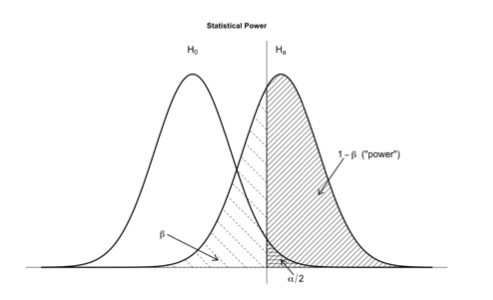

Today
=========================

- Data Snooping
- Multiple Comparison Adjustments
- Power Calculations

```{r}
# Library
library(mvtnorm)

```

---


Data Snooping
=========================

We will compare two scenarios. In both scenarios, we will start with a design matrix with 50 independent variables with 100 observations and an outcome variable that is generated independently. That is, there is no true association between the outcome and any of the variables in the design matrix. 

Case 1: The researcher runs a regression using all these variables and reports these results. 
Case 2: The researcher runs a regression using all these variables but instead of reporting these results, she screens the p-values and keeps just the variables that come up as significant in this first regression. Then, she runs a regression including only those variables. She only reports the results of this final regression. 

To understand the distortions generated by data snooping, we will replicate these process 10,000 times and compare the proportion of significant p-values in the reported regression. 


Scenario 1
================

```{r}

# First let's create the variance-covariance matrix for the design matrix
# They will all be independent, so the off diagonal elements will be zero 
varcov <- matrix(0, 50, 50)
diag(varcov) <- 1

noscreen <- function(n=100, design=50) {
    
    Y <- rnorm(n)
    
    # varcov matrix for the design matrix
    # independent, so the off diagonal elements will be zero 
    varcov <- matrix(0, design, design)
    diag(varcov) <- 1
    # design matrix
    X <- rmvnorm(n, mean=rep(0, design), sigma=varcov)
    
    # regress Y on X, without an intercept
    fit <- summary(lm(Y ~ 0 + X))

    # return the proportion of coefficients significant at 0.05 level
    sum(fit$coefficients[,4] < 0.05)/design

}

```

Scenario 2
================

```{r}

screen <- function(n=100,design=50) {
    
    Y <- rnorm(n)
    
    # varcov matrix for the design matrix
    # independent, so the off diagonal elements will be zero 
    varcov <- matrix(0, design, design)
    diag(varcov) <- 1
    # design matrix
    X <- rmvnorm(n, mean=rep(0, design), sigma=varcov)
    
    # regress Y on X, without an intercept
    fit <- summary(lm(Y ~ 0 + X))
    
    # create a vector indicating the variables we should keep 
    # (the significant ones)
    keeps <- fit$coefficients[,4]<0.05
    if (sum(keeps)>0){ Xscreen <- X[, keeps] }
    # if none is significant, we just keep all of them 
    if (sum(keeps)==0) { Xscreen <- X }
    
    # regress Y on the keepers
    fit <- summary(lm(Y ~ 0 + Xscreen))
    
    # return the proportion of coefficients significant at 0.05 level
    # note that the total number of variables now is not "design" any more, 
    # but the set that was significant in the first regression
    if (sum(keeps)>0){ prop <-sum(fit$coefficients[,4] < 0.05)/sum(keeps) }
    # if none is significant in the first reg, then denominator=design
    if (sum(keeps)==0){ prop <-sum(fit$coefficients[,4] < 0.05)/design }

    return(prop)

}

```

---

Let's replicate each 10,000 times
```{r}
set.seed(1234)
H <- replicate(10000, noscreen(n=100, design=50))
H_screen <- replicate(10000, screen(n=100, design=50))

```

And compare the means
```{r}
mean(H)
mean(H_screen)

```

---

Let's compare the distribution of the proportion of significant p-values
```{r, fig.height=4}
par(mfrow=c(1, 2))
hist(H, col="slateblue", xlim=c(0, 1), breaks=25, ylim=c(0,10000))
abline(v=.05, col="darkorange", lwd=3)
hist(H_screen, col="deepskyblue", xlim=c(0, 1), breaks=25, ylim=c(0,10000))
abline(v=.05, col="darkorange", lwd=3)

```
How should we interpret these results?


Multiple comparison adjustments
========================================

Bonferroni and FDR (false discovery rate)

Setup: here we have an experiment with 20 outcomes and a treatment assignment vector. The covariates will have a covariance of .2 (is this likely to be the case in applications?)
```{r}
set.seed(55)
varcov <- matrix(0.2, 20, 20)
diag(varcov) <- 1
Y <- rmvnorm(100, mean=rep(0, 20), sigma=varcov)

t <- rbinom(100, 1, .5)

```

---

First we will look at the individual tests. For this, we will need our t-test function.
```{r}
source("https://raw.githubusercontent.com/unc421/231b/master/Functions/t_test.R")
```

And now for each variable, we run a t-test.
```{r}
results <- matrix(NA, 20, 8)
for (i in 1:ncol(Y)){ results[i,] <- ttest(Y[,i], t) }
colnames(results) <- c("Mean 1", "Mean 0", "Difference", 
                  "SE Diff","t-stat", "N", "df", "p-value")
rownames(results) <- paste("outcome", 1:20, sep=" ")
```

---

```{r}
results
```

---
Let's look at the vector of p-values
```{r}
results[,8]
results[,8] <= .05
sum(results[,8] <= .05)
```

---

Bonferroni: now the reference level is:
```{r}
bonf <- .05/length(results[,8])
bonf
```

We will add a column indicating if we reject the null using this new reference level
```{r}
bonferroni_reject <- results[,8] <= bonf
results <- cbind(results, bonferroni_reject)

```

---

For FDR, we will need to order the results according to the p-values
```{r}
order <- order(results[,8], decreasing=FALSE)
results <- results[order, ]
```

FDR referece
```{r}
fdr_ref <- .05 * (1:20 / 20)
```

Now we compare each observed p-value to its reference
```{r}
results[,8] <= fdr_ref
```

How should we proceed now?

---

## Power Analysis



Under $H_0$ the distribution of the ATE is approximately $N(\mu_0,V(\hat{ATE}))$. Under $H_1$, the ATE is approximately distributed $N(\mu_1, V(\hat{ATE}))$.

For a given value of $\mu_1$, power is the proportion of the $H_1$ distribution beyond the critical value.


---

```{r}

sample_size <- seq(from=100, to=2000, by=10) 

alpha <- 0.05 

# placeholder
power <- rep(NA, length(sample_size))                                
sims <- 100

#### Loop to varying the number of subjects

for (j in 1:length(sample_size)){

    N <- sample_size[j]                         

    significant <- rep(NA, sims)  
 
    for (i in 1:sims){
        
        # Potential outcomes
        Y0 <-  rnorm(n=N, mean=60, sd=20)            
        tau <- 5                                       # hypothesized treatment effect
        Y1 <- Y0 + tau                                 
        
        # Simulate random assignment
        treat <- rbinom(n=N, size=1, prob=.5)        
        
        # observed outcomes
        Y_obs <- ifelse(treat==1, Y1, Y0)
        
        fit.sim <- t.test(Y_obs ~ treat)   
  
        significant[i] <- (fit.sim$p.value <= alpha) 
  
}
 
# store average success rate (power) for each N
power[j] <- mean(significant)       

}

power

```

---

```{r}
par(mfrow=c(1,1))
plot(sample_size, power, col="slateblue", pch=16)
abline(h=.8, col="darkorange", lwd=3)

```
