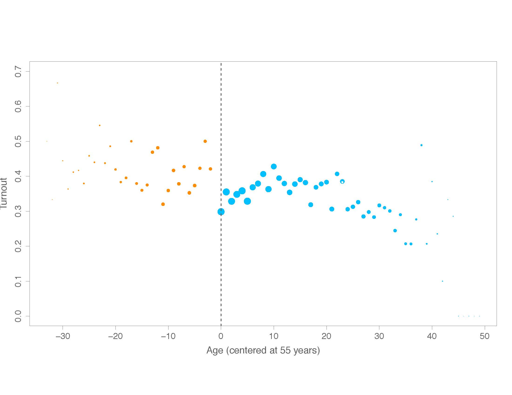
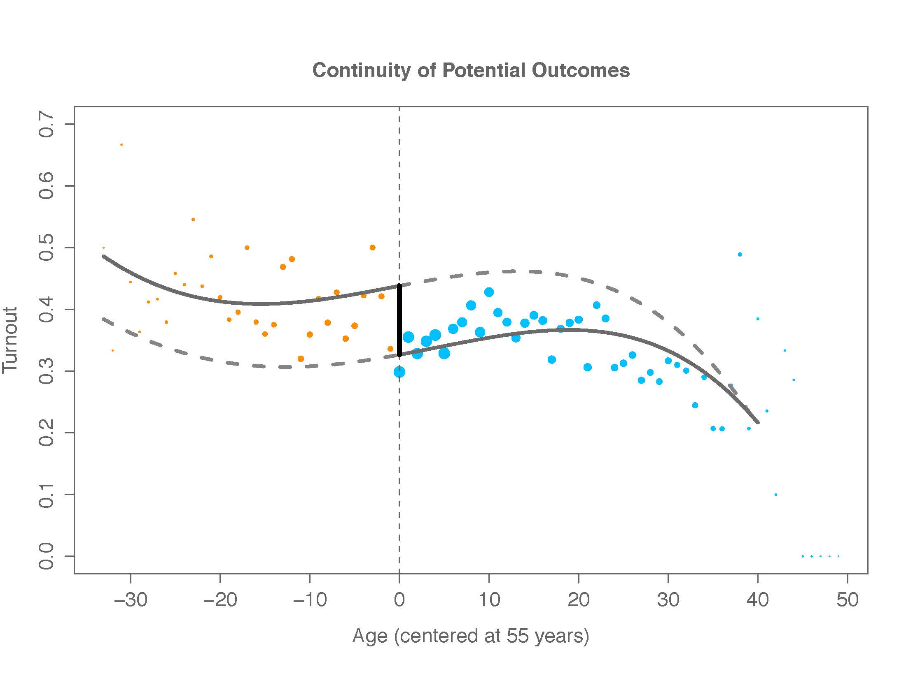
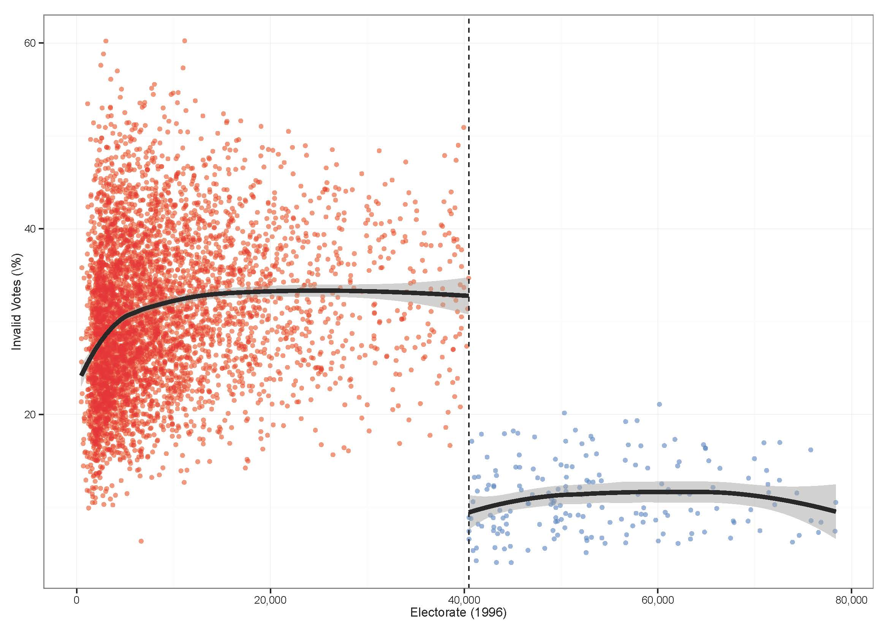
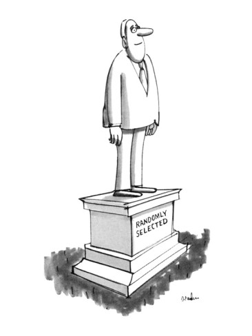

## Today

- Fixed effects
- Diff-in-diff
- RDD
- Optional: Review of MLE from problem set


---


Let's say we are interested in understanding the effects of voting machines on spoiled ballots in different countries over time. 

>- What are our options? 

>- Panel data!


---

## Panel data

```{r, echo=FALSE}
load("C:/Users/chris/Dropbox/231b_github/section_9/country_data.Rda")
summary(country_data$y)
country_data$y <- country_data$y/max(country_data$y)
```

Panel data (also known as longitudinal or time-series, cross-sectional data) is a data set in which the behavior of entities are observed across time. These entities could be states, companies, individuals, countries, etc.

```{r}
head(country_data)
```

---

```{r, echo=FALSE}
library(gplots)
```

---

For this exercise, we will focus on the heterogeneity across countries:

```{r, fig.height=4, fig.width=9}
par(mfrow=c(1,2))
plotmeans(y ~ country, main="Heterogeineity across countries", ylab = "% of spoiled ballots", data=country_data)
plotmeans(y ~ year, main="Heterogeineity across years", ylab = "% of spoiled ballots", data=country_data)
```

```{r, echo=FALSE}
par(mfrow=c(1,1))
```

---

Regular OLS does not consider heterogeneity across groups or time...
```{r, fig.height=4}
ols <-lm(y ~ x1, data=country_data)
summary(ols)
```

---

```{r, fig.height=5, fig.width=5}
par(mfrow=c(1,1))
plot(country_data$x1, country_data$y, pch=19, xlab="x1", ylab = "% of spoiled ballots")
abline(lm(country_data$y~country_data$x1),lwd=3, col="red")

```
---

## Fixed effects

Fixed-effects models help to isolate the effects of within-unit variation---though coefficients are pooled across units.


$$ spoiled_{it}= \alpha_i + \beta D_{it} + \epsilon_{it} $$ where there is one dummy variable ("fixed effect") $\alpha_i$ for each unit $i$ (here unit=country). This fixed-effect is a unit-specific intercept.

How will the design matrix look here?

What does problems of a normal regression might be solved in this fixed effects design?


---

```{r}

fixed.dum <-lm(y ~ x1 + factor(country) - 1, data=country_data)
summary(fixed.dum)

```

---

Each component of the factor variable (country) is absorbing the variation particular to each country. 

```{r, echo=FALSE}
library(car)
```

```{r, fig.height=6, fig.width=6}

yhat <- fixed.dum$fitted
scatterplot(yhat~country_data$x1|country_data$country,
            xlab="% of voters using\n machine voting", ylab="yhat")
abline(lm(country_data$y~country_data$x1), lwd=5, col="black")


```

---


Let's say we are interested in understanding the effects of voting machines on spoiled ballots in Elbonia. We find half the states implemented the electronic voting in 1998 and half did not. He has data from the 1996 and 1998 presidential elections. 

>- He runs the following regression with precincts, $i$:  $$\%\_spoiled_{i} = \beta_{0} + \beta_{1}electronic_{i} + \beta_{2}1998_{i} + \beta_{3}electronic_{i} \times 1998_{i}  + \epsilon_{i}$$


>- What is this design?

>- What coefficient do we want to interpret? 

>- What might be a problem here with the estimate and its (estimated) variance?


---

## Regression Discontinuity Design

>- Lots of desirable properties.

>- But some challenges...

>- Estimand: Local linear vs. local randomization

>- Also: Bandwidth choice, polynomial order, kernel weight

>- Interpretation: What effect are we identifying?

---

## Regression Discontinuity Design

 


---


## Regression Discontinuity Design

 


---

Back to the example of voting machines...

Hidalgo - Electronic Voting

 


---


## Exercise

 

We will use `rddata.Rda` to estimate the effect of having a left-wing party in office on social spending

---

```{r}

load("rddata.Rda")
head(data)
```

---

```{r}

# How many municipalities?
length(unique(data$municipality))

# How many candidates per municipality?
nr_cand <- NA
for (i in 1:6000){ nr_cand[i] <- nrow(data[data$municipality==i,]) }
mean(nr_cand)
sd(nr_cand)

# NA observations for running variable?
sum(is.na(data$vs_2000))
```

---

What type of dataset do we need for the RD analysis? How can we build it?

---

```{r}
# Building RD dataset
rd_data <- NA

for (i in 1:6000){

    # get mini muni data
    temp <- data[data$municipality==i, ]
    # 1. keep winner and loser
    temp$order <- order(temp$vs_2000, decreasing = TRUE)
    temp <- temp[temp$order!=3, ]
    
    # 2. drop if no left
    temp$left <- ifelse(temp$party=="left", 1, 0)
    if (sum(temp$left)==0) {temp$margin <- NA}
    
    # 3. left margin
    if (sum(temp$left)==1){
        temp$margin <- temp$vs_2000[temp$left==1] - 
            temp$vs_2000[temp$left==0]}
    
    # put together in final dataset
    rd_data <- rbind(rd_data, temp)
    
    if (i/1000==round(i/1000)) print(i)
    
}
```

---
```{r}

head(rd_data)
```

---

```{r}
# dropping cases with no left wing party winner or runner up
rd_data <- rd_data[is.na(rd_data$margin)==F, ]
head(rd_data)
dim(rd_data)
length(unique(rd_data$municipality))
```

---

```{r}
# creating the treatment variable
rd_data$treat <- ifelse(rd_data$left==1 & rd_data$margin>=0, 1, 0)
table(rd_data$treat)

# keeping only the winner
rd_data <- rd_data[rd_data$order==1, ]
table(rd_data$treat)
```
---

```{r}

# t-test in 5% margin
with(rd_data[abs(rd_data$margin)<=5, ],
     t.test(soc_spend ~ treat))

```

---

## Hidalgo - Electronic Voting

 


---

## Robustness tests

>- Varying cutpoint
>- Test for discontinuities in covariates at cutpoint (which?)
>- In fuzzy design, test significance of ``first stage'' discontinuity at cutpoint (next week)


