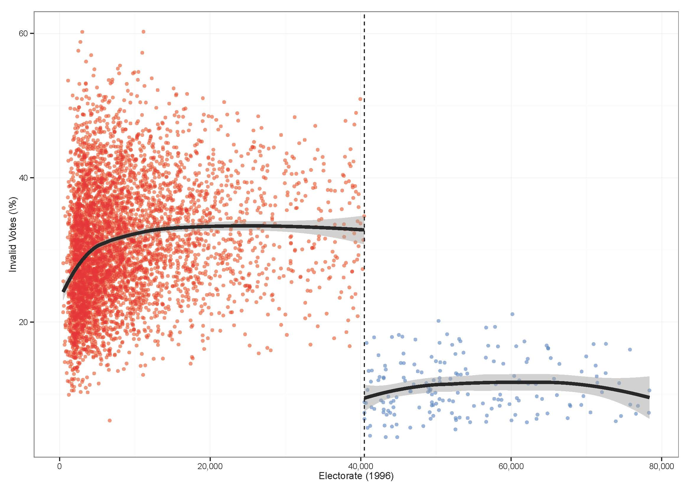
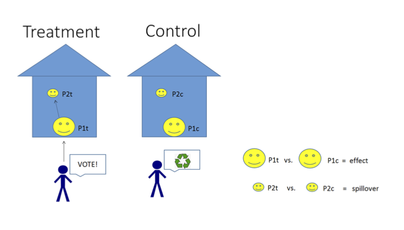
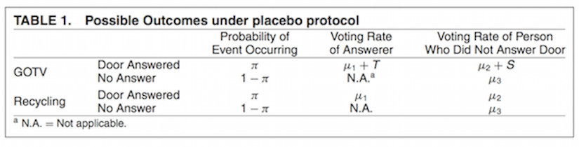
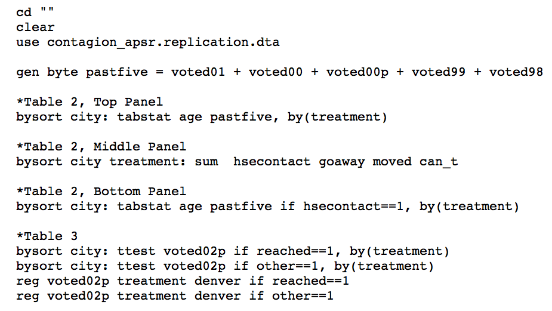

## Agenda for Today

- Finishing RDD
- Missing data
- Spillover effects
- the F-test

---


## Exercise

 

We will use `rddata.Rda` to estimate the effect of having a left-wing party in office on social spending

---

```{r}

load("rddata.Rda")
head(data)
```

>- What problems might we face using this dataset for our RDD?

---

```{r}

# How many municipalities?
length(unique(data$municipality))

# How many candidates per municipality?
nr_cand <- NA
for (i in 1:6000){ nr_cand[i] <- nrow(data[data$municipality==i,]) }
mean(nr_cand)
sd(nr_cand)

# NA observations for running variable?
sum(is.na(data$vs_2000))
```

---

What type of dataset do we need for the RD analysis? How can we build it?

---

```{r}
# Building RD dataset
rd_data <- NA

for (i in 1:6000){

    # get mini muni data
    temp <- data[data$municipality==i, ]
    # 1. keep winner and loser
    temp$order <- order(temp$vs_2000, decreasing = TRUE)
    temp <- temp[temp$order!=3, ]
    
    # 2. drop if no left
    temp$left <- ifelse(temp$party=="left", 1, 0)
    if (sum(temp$left)==0) {temp$margin <- NA}
    
    # 3. left margin
    if (sum(temp$left)==1){
        temp$margin <- temp$vs_2000[temp$left==1] - 
            temp$vs_2000[temp$left==0]}
    
    # put together in final dataset
    rd_data <- rbind(rd_data, temp)
    
    if (i/1000==round(i/1000)) print(i)
    
}
```

---
```{r}

head(rd_data)
```

---

```{r}
# dropping cases with no left wing party winner or runner up
rd_data <- rd_data[is.na(rd_data$margin)==F, ]
head(rd_data)
dim(rd_data)
length(unique(rd_data$municipality))
```

---

```{r}
# creating the treatment variable
rd_data$treat <- ifelse(rd_data$left==1 & rd_data$margin>=0, 1, 0)
table(rd_data$treat)

# keeping only the winner
rd_data <- rd_data[rd_data$order==1, ]
table(rd_data$treat)
```
---

```{r}

# t-test in 5% margin
with(rd_data[abs(rd_data$margin)<=5, ],
     t.test(soc_spend ~ treat))

```

---


## Robustness tests

>- Varying cutpoint
>- Test for discontinuities in covariates at cutpoint (which?)
>- In fuzzy design, test significance of "first stage" discontinuity at cutpoint. How would that look here?

---

## Hidalgo - Electronic Voting

 


---

>- Let's imagine that Hidalgo looks at his data and finds that data for about 2\% of polling places are missing in each state except Pernambuco, where 20\% of the data is missing. Is this a problem? Why?

>- What if 2\% of the data were also missing from Pernambuco? Would that be a problem? Why or why not?

>- How might Hidalgo address this problem?

---


>- A key concern in experimental and observational work are spillovers. 

>- How do we define spillovers (AKA Sutva, interference)?

>- Why are they an issue?


---

## Nickerson (2008): Is Voting Contagious? 

Intra-household voter behavior is correlated, but how much of this is contagion?

Strategy: Treat only one voter in two-voter households, but measure the outcome for both voters. 

Can we estimate the spillover effects by comparing treated and control households?

> - If you only compare treated and control, you don't know who would have answered the door for the control group. 

> - Why could this be a problem?

---

## Nickerson (2008): Is Voting Contagious? 

Idea: placebo treatment.

A placebo treatment allows us to record who answers the door for both treatment and placebo group. 

By identifying "primary" contacted and "secondarily" contacted units in each household, the spillover effect can be estimated.

----






---

## Nickerson (2008): Is Voting Contagious? 

# The data 

```{r, echo=FALSE}

library(foreign)
data <- read.dta("/Users/chris/Dropbox/231b_github/section_11/contagion_apsr.replication.dta")
```

```{r}

head(data)

```

---

```{r}

table(data$reached, data$other)

table(data$treatment)

```

---

## Replication

```{r}

contacted <- data[data$hsecontact==1, ]

table(contacted$treatment)

contacted$treatment <- as.numeric(contacted$treatment==1)

table(contacted$treatment)

```

---

```{r}

direct <- with(contacted[contacted$reached==1, ],
               t.test(voted02p ~ treatment, alternative="less"))
direct

secondary <- with(contacted[contacted$other==1, ],
               t.test(voted02p ~ treatment, alternative="less"))
secondary

```

---

## Nickerson by Nickerson




---

## Looking at balance in the Nickerson experiment

```{r, echo=FALSE}
contacted$gender <- as.numeric((contacted$gender=="F"))
contacted$party <- as.numeric((contacted$party=="DEMOCRATIC"))
```

```{r}

names(contacted)

with(contacted, t.test(age ~ treatment))$p.value
with(contacted, t.test(gender ~ treatment))$p.value
with(contacted, t.test(party ~ treatment))$p.value
with(contacted, t.test(voted01 ~ treatment))$p.value
```


---

##More balance tests
```{r}
with(contacted, t.test(voted00 ~ treatment))$p.value
with(contacted, t.test(voted00p ~ treatment))$p.value
with(contacted, t.test(voted99 ~ treatment))$p.value
with(contacted, t.test(voted98 ~ treatment))$p.value

```

But how would we test whether the *set* of covariates can jointly predict treatment assignment better than chance?

---

## The F-test 

The F-test is used to conduct a significant test for the joint hypothesis that all coefficients are zero. The null hypothesis is of the form  $H0 : \beta_1 = \beta_2 = . . . = \beta_k = 0$.

We are comparing two models: one in which the coefficients of the pre-treatment covariates are allowed to vary and another in which they are constrained to zero. 

---

The test statistic is:

$F_{0}=\frac{(SSR_{r}-SSR_{ur})/q}{SSR_{ur}/(n-(k+1))}$

where $SSR_{r}$ stands for the sum of the squared residuals of the restricted model and $SSR_{ur}$ sum of the suared residuals of the unrestricted model. $n$ is the number of observations, $k$ is the number of independent variables in the unrestricted model and $q$ is the number of restrictions (or the number of coefficients being jointly tested).

---

The regression output in `R` reports the F-test:


```{r}

reg <- with(contacted, 
            lm(treatment ~ age + gender + party + voted01 + voted00 + voted00p + voted99 + voted98))

```

```{r}

summary(reg)

names(summary(reg))

summary(reg)$fstatistic

```

---


We can also calculate the F-test by hand. We first need $SSR_{ur}$. 

```{r}
SSRur <- sum(reg$residuals^2)
SSRur
```

What about $SSR_{r}$. What is this restricted model?

---

```{r}

regr <- with(contacted, lm(treatment ~ 1))

SSRr <- sum(regr$residuals^2)
SSRr

```

What are $n$, $q$ and $k$?

----

$n$ is the number of observations,
```{r}
n <- nrow(contacted)
```

$k$ is the number of independent variables in the unrestricted model
```{r}
reg$coefficients
length(reg$coefficients)
k <- length(reg$coefficients) - 1
```

and $q$ is the number of restrictions.
```{r}
q <- length(reg$coefficients) - 1
```

---

Recall $F_{0}=\frac{(SSR_{r}-SSR_{ur})/q}{SSR_{ur}/(n-(k+1))}$

```{r}

df1 <- q
df2 <- n-(k+1)

F0 <- ((SSRr-SSRur)/df1) / (SSRur/df2)
F0
```

---

```{r, echo=FALSE}
x <- seq(0, 5, .01)
y <- df(x=x, df1=df1, df2=df2)
plot(x, y, type="l", lwd=3, col="blue", main=paste0("F distribution with df1=",df1," and df2=",df2))
abline(v=F0, col="red", lty=3, lwd=2)
```


How do we calculate the p-value?

---

```{r}
F0
df1
df2

1 - pf(F0, df1=df1, df2=df2)

```

Does the validity of the test follow from the mechanical properties of OLS? What assumptions are we making?

We are assuming:

>- treatment assignment is a linear combination of the covariates.

>- normality of the error term in both regressions (where are we assuming this?)

Can we relax any of these assumptions?

---

## An alternative: randomization F-test

```{r}
library(ri)

perms <- genperms(Z=contacted$treatment)

dim(perms)

```


---

```{r}

perm_f <- NULL

for (i in 1:ncol(perms)){
    
    contacted$treat <- perms[,i]
    
    reg <- with(contacted, 
            lm(treat ~ age + gender + party + voted01 + 
                   voted00 + voted00p + voted99 + voted98))
    
    perm_f[i] <- summary(reg)$fstatistic[1]
    
}

head(perm_f)

perm_fdist <- density(perm_f)

```

```{r, echo=FALSE}

par(mfrow=c(1,2))

plot(x, y, type="l", lwd=3, col="blue", main=paste0("F distribution with df1=",df1," and df2=", df2))
abline(v=F0, col="red", lty=3, lwd=2)

plot(perm_fdist, lwd=3, col="blue", main="Permutation distribution of the F-test")
abline(v=F0, col="red", lty=3, lwd=2)

```
