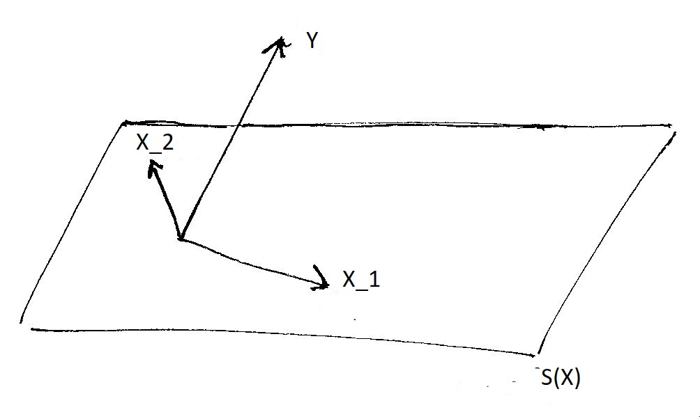
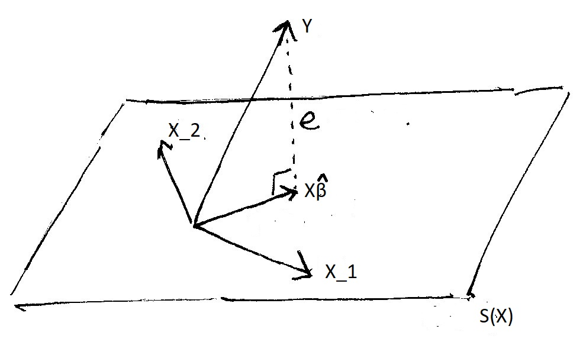

```{r, echo=FALSE}

rm(list=ls())

```
```{r, echo=FALSE, include = FALSE}

library(MASS)
library(car)
library(rgl)
library(scatterplot3d)
library(ggplot2)


```


Agenda for today
========================================================
- Review

- Hypothesis testing

- Linear regression function 

- Plotting the regression and the SD lines

- Matrix algebra and multiple regression coefficients

- Multiple regression in 3d


---

Review
========================================================

> - Review of problem set issues

> - What are the variance formulas we have studied so far? When do we use them?

> - What is hypothesis testing? What are the two types of hypothesis testing we have discussed so far? What are the costs and benefits of each?

---

1. Hypothesis testing 
========================================================

```{r}
gg_data <- as.data.frame(cbind(c(10,15,20,20,10,15,15), 
                               c(15,15,30,15,20,15,30)))
names(gg_data) <- c("Y_i0", "Y_i1")
# generating treatment vector for a given experiment
gg_data$treat <- c(1, 0, 0, 0, 0, 0, 1)

# getting observed outcomes
gg_data$observed <- ifelse(gg_data$treat==1, gg_data$Y_i1, gg_data$Y_i0)

# ate
ATE <- mean(gg_data$observed[gg_data$treat==1]) - mean(gg_data$observed[gg_data$treat==0])
ATE

```
---


1a. T-test
========================================================

```{r}
treated <- gg_data$observed[gg_data$treat==1]
treated

var1 <- sum((treated - mean(treated))^2) / (length(treated) - 1)
var1

not_treated <- gg_data$observed[gg_data$treat==0]
not_treated

var0 <- sum((not_treated - mean(not_treated))^2) / (length(not_treated) - 1)
var0

estimated_se <- sqrt(var1/length(treated) + var0/length(not_treated))
estimated_se # Why is this number different from 7.75 (the number in the lecture slides)?
# rounding!

```

---

```{r}

# converting to standard units
t_stat <- (ATE - 0) / estimated_se
t_stat

# To get the right Student t Distribution, we need to calculate
# the degrees of freedom (Satterthwaite)
df <- (var1/length(treated) + var0/length(not_treated))^2 / 
           ((var1/length(treated))^2 / (length(treated) - 1) + 
           (var0/length(not_treated))^2 / (length(not_treated) - 1))
df

```

> - Why do we need dfs?

> - What is a p-value?

---

- What is the difference in a one- and two-tailed p-value?
```{r}

# Overlaying the t_stat to the student t distribution
ggplot(data.frame(x = c(-5, 5)), aes(x)) + 
  stat_function(fun=dt, args=list(df=df, ncp=0), col="blue", size=1) +
  geom_vline(xintercept=mean(t_stat), col="red", size=1.25) 
```

---

```{r}
# One tailed p-value
pt(t_stat, df=df, ncp=0, lower.tail=F)

# Two tailed p-value
pt(-t_stat, df=df, ncp=0, lower.tail=T) + pt(t_stat, df=1.12, ncp=0, lower.tail=F)

```


1b. Randomization inference 
===========================================================================

To get all the possible treatment vectors, we will generate 10000 different ones...

```{r}
fake_treats <- matrix(NA, 10000, 7)
for (i in 1:10000){
fake_treats[i,] <- sample(gg_data$treat, 7, replace=F)
}

```

... and then only keep the unique ones

```{r}

fake_treats <- unique(fake_treats)

```

---

Now we need to calculate the ATE for each of these possible randomizations. For that, we will need a loop

```{r}
rand_ate <- NA # placeholder vector for results

for (i in 1:nrow(fake_treats)){ # for each of the fake treatment vectors
  
  mean_treat <- mean(gg_data$observed[fake_treats[i,]==1])
  
  mean_control <- mean(gg_data$observed[fake_treats[i,]==0])
  
  # calculating ATE for this randomization
  rand_ate[i] <- mean_treat - mean_control
  
}

```

---

Now we can plot the distribution of the randomization ATEs

```{r, echo=FALSE, fig.height=4, fig.cap="Distribution of randomization ATEs"}

m <- ggplot(as.data.frame(rand_ate), aes(x=rand_ate))
m + 
  geom_histogram(aes(y = ..density..), binwidth=.5) +
  geom_vline(xintercept=ATE, col="red", size=1) +
  theme_bw() +
  xlab("Randomization ATEs") +
  ylab("Density")

```

---

And we can get the p-value

```{r}

# One tailed
sum(rand_ate>=ATE)/length(rand_ate)

# Two tailed
sum(abs(rand_ate)>=ATE)/length(rand_ate)


```


Libraries and dataset you will need for this section 
========================================================

```{r, eval=FALSE}

library(MASS)
library(car)
library(rgl)
library(scatterplot3d)


```

We will be using the `family.rda` dataset, which we can download directly from the internet.

```{r}
load(url("http://www.stat.berkeley.edu/users/nolan/data/stat133/family.rda"))
```

---

Let's see what we have here:

```{r}
dim(family)
family
```


---

Linear Regression
========================================================
> - Why have we (in lecture) been using $\hat{\beta}$ instead of $\beta$ and $e$ instead of $\epsilon$?


---

We will work on linear regression with 4 coding exercises 

A. Write a function that calculates `r`, the correlation between two variables. Use only the functions `sum()`, `mean()`, `sqrt()` and `length()`.

```{r, eval=FALSE}
r <- function(x, y){
  # This function takes two variables as input and returns their correlation.

}
```

---

```{r}
# Correlation function using sum, mean, and length
r <- function(x, y) {
  # this function takes two variables as input and returns their correlation.
  
  # lengths
  n_x = length(x)
  n_y = length(y)
  
  # means  
  mean_x = mean(x)
  mean_y = mean(y)
  
  # sd_x, with no df correction
  sd_x = sqrt(sum((x - mean_x)^2) / (n_x))
  # sd_y, with no df correction
  sd_y = sqrt(sum((y - mean_y)^2) / (n_y))
  
  # cov(x, y)
  cov_x_y = mean((x - mean_x)*(y - mean_y))
  
  # cov(x, y) / (sd_x * sd_y)
  cov_x_y / (sd_x * sd_y)
}

```

---

Another way to do it:

```{r}
r <- function(x, y){
  # This function takes two variables as input and returns their correlation.
  
  sx <- sqrt(mean((x-mean(x))^2))
  sy <- sqrt(mean((y-mean(y))^2))
  
  
  r <- sum(((x - mean(x))/sx) * ((y - mean(y)) / sy)) / (length(x))
  
  return(r)

}

```

---

B. Find the equation for the regression line predicting weight from height in the dataset (the column labels are fweight and fheight). Use only the functions `sd( )`, `mean( )`, `var( )` and your own `r()` function. 
You can assign intermediate values to `sx`, and `sy` if you want, but it's not necessary.

---

```{r}
# variables
x <- family$height
y <- family$weight

# sds
sx <- sqrt(mean((x-mean(x))^2))
sy <- sqrt(mean((y-mean(y))^2))

# coefficients
b_hat <- r(x,y) * (sy/sx)
a_hat <- mean(y) - b_hat*mean(x)

c(a_hat, b_hat)

```

---

C. Organize what you did in (B) into a function called `regcoef()` that has a two arguments, an `x` and a `y` variable. The function should return a vector of length 2 with the regression coefficients predicting `y` from `x`.

```{r, eval=FALSE}

regcoef <- function(y, x){
  # This function takes two variables as input and returns regression 
  # coefficients predicting the first variable from the second.
  

}
```

To see if it works, you should be able to do
```{r, eval=FALSE}
regcoef(y=family$weight, x=family$height)
```

and get the results you got for (B). 

(If you are feeling fancy, you can also add names describing what each coefficient is).

---

One way of doing this:

```{r}
regcoef <- function(y, x){
  # This function takes two variables as input and returns regression 
  # coefficients predicting the first variable from the second.
  
  # sds
  sx <- sd(x)
  sy <- sd(y)
  
  # correlation
  r <- sum(((x - mean(x))/sx) * ((y - mean(y)) / sy)) / (length(x)-1)
  
  # coefficients
  b_hat <- r * (sy/sx)
  a_hat <- mean(y) - b_hat*mean(x)
  
  # output
  out <- c(a_hat, b_hat)
  names(out) <- c("b_0", "b_1")
  return(out)
}
```

---

```{r}
regcoef(y=family$weight, x=family$height)

lm(family$weight ~ family$height)

```

How would you interpret this output? What is `r regcoef(y=family$weight, x=family$height)[1]`?  Is this a useful number?

> - We are extrapolating from the data...

---
  
  
D. Write another function, called `regline()`, that will take the same inputs as `regcoef` and plot the data for `x` and `y` as well as the regression line (in red).  

Functions to use: `regcoef()`, `plot()`, `lines()`, `abline()`.

```{r, eval=FALSE}
regline <- function(y, x){
  # This function plots a scatterplot with the regression line in red.
  }
```

The only output of the function should be the plot. Please save your plots and drop them here: <https://dbinbox.com/231b_spring2019>

---

One way of doing this:

```{r}


regline <- function(x, y){
  
  # lengths
  n_x = length(x)
  n_y = length(y)
  
  # means  
  mean_x = mean(x)
  mean_y = mean(y)
  
  # sd_x, with no df correction
  sd_x = sqrt(sum((x - mean_x)^2) / (n_x))
  # sd_y, with no df correction
  sd_y = sqrt(sum((y - mean_y)^2) / (n_y))
  
  # cov(x, y)
  cov_x_y = mean((x - mean_x)*(y - mean_y))
  
  # cov(x, y) / (sd_x * sd_y)
  corr<-cov_x_y / (sd_x * sd_y)
  
  coef<-corr*(sd_y/sd_x)
  intercept<-mean(y)-coef*mean(x)
  
  res<-c(corr, intercept, coef)
  plot(x,y)
  abline(intercept, coef, col="red")
  names(res)<-c("corr","intercept","coef")
  return(c(res))
}
```
---
```{r}
with(family, regline(fheight, fweight))


```

---
```{r}

regline <- function(y, x){
  # This function plots a scatterplot with the regression line in red.
  
  coefs <- regcoef(y, x)
  
  plot(x, y, pch=16)
  lines(x, (coefs[1]+coefs[2]*x), col="red", lwd=2)
  
  
  
}

```

---

```{r, fig.height=5, fig.width=6}
regline(y=family$weight, x=family$height)

```

---

It is important that you understand the syntax line we use to add the regression line!

```{r, eval=FALSE}
  lines(x, (coefs[1]+coefs[2]*x), col="red", lwd=2)
```

What is the `y` argument here?

---


Multivariate regression
===================================================

Now we will use height and bmi to predict weight. This is the plot we had, except now the size of the points is proportional to bmi. Any pattern here?

```{r, echo=FALSE, fig.height=5.5, fig.width=6.5}

par(mfrow=c(1,1))

size <- (family$bmi)^2/sum(family$bmi) 

plot(family$height, family$weight, pch=16, cex=size, col="grey10")
abline(lm(family$weight ~ family$height), col="red", lwd=2)


```

(The interest in regressing weight on height and BMI is dubious, as BMI is closely related to weight...)

---

Calculating multivariate regression coefficients with matrix algebra
===================================================

From lecture, we know $\hat{\beta}=(X'X)^{-1} X'Y$. 

We will use this to calculate $\hat{\beta}$ "by hand" in `R`.

For this, we will need `X` and `Y`. What should the dimensions of each of these be? How do we build them?

---

`Y` is easy. We just need a vector with the values for `weight`. 

```{r}

Y <- as.matrix(family$weight)

Y

```

What about `X`?

---

We will need to add a column of `1s` for the intercept and bind it to the `height` and `bmi` vectors.

Do we `rbind` or `cbind`?

---

```{r}

X <- as.matrix(cbind(1, family$height, family$bmi))

dim(X)

```

---

```{r}
X

```

---

**Exercise** Find $\beta$. 
Hints: `t()`,  `%*%`, `det()`, `solve()`.

---

Let's do this by parts. 

Part 1: $(X'X)$

```{r}

XprimeX <- t(X) %*% X

dim(XprimeX)

XprimeX

```

What does this matrix give us?

What happens when we get the inverse?

---

Part 2: $(X'Y)$

```{r}

XprimeY <- t(X) %*% Y

dim(XprimeY)

XprimeY

```

What about this one?

---

Let's put all of this together

```{r}

(solve(XprimeX)) %*% XprimeY

lm(Y~X[,2:3])

```

---

The column space of X
====================================================

The "column space of $X$", $S(X)$, is the collection of all the points that can be expressed as $X\beta$, ie. that can be written as linear combinations of the columns in $X$. When $X$ is a matrix with two independent variables, this collection of points is a plane.


```{r, echo=FALSE}

rheight <- range(family$height) 
height <- seq(rheight[1], rheight[2], length = length(family$height))

rbmi <- range(family$bmi) ; 
bmi <- seq(rbmi[1], rbmi[2], length = length(family$bmi))

z <- outer(height, bmi)
```


---

Orthogonal projection of $Y$ onto column space of X, $S(X)$

```{r, out.width = "800px", echo = FALSE}

```

---


The OLS problem: given $X$ and $Y$, find $\hat{Y}$, the points on $S(X)$ that are closest to $Y$.  $\hat{Y}$ is often called the "orthogonal projection" of $Y$ onto the column space of $X$.


```{r, out.width = "800px", echo = FALSE}

```
