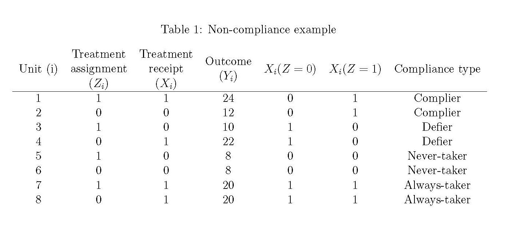

```{r, eval=FALSE}

rm(list=ls())
#install.packages("sem")
library(sem)

```

```{r, echo=FALSE}

library(sem)
set.seed(5000)

```

---

## Today

- Clarification points on problem set
- What is IV under the potential outcomes framework?
- Some IV examples 


---

Problem set clarifications
=========================================================

> - What is the difference between $E(X)$, $\bar{X}$, and $\bar{x}$? 

> - Orthogonality vs. independence

> - Let's say we are given three matrices, $X'X$, $X'Y$, and $Y'Y$? $X$ is a $20 \times 2$ matrix. We want to test whether there is a significant relationship between $X$ and $Y$. Where do we start?


---

Problem set clarifications
=========================================================
 
 - What is the difference between $E(X)$, $\bar{X}$, and $\bar{x}$? 

 - Orthogonality vs. independence

 - Let's say we are given three matrices, $X'X$, $X'Y$, and $Y'Y$? $X$ is a $20 \times 2$ matrix. We want to test whether there is a significant relationship between $X$ and $Y$. Where do we start?

\begin{equation}
X'X = \left( \begin{array}{cc} 
21 & 854.21 \\
854.21 & 53530.38 \\ \end{array} \right),
\end{equation}

\begin{equation}
X'Y = \left( \begin{array}{c} 
610.36 \\
40597.39 \\ \end{array} \right),
\end{equation}

and

\begin{equation}
Y'Y = 35141.94.
\end{equation}

---

\begin{align}
(X'X)^{-1} & =  \frac{{\rm adj(X'X)}}{{\rm det(X'X)}}\\
 & =  \frac{1}{394463.26}\begin{bmatrix}53530.38 & -854.21\\
-854.21 & 21
\end{bmatrix}\\
(X'X)^{-1}X'Y & =  \frac{1}{394463.26}\begin{bmatrix}53530.38 & -854.21\\
-854.21 & 21
\end{bmatrix}\begin{bmatrix}610.36\\
40597.39
\end{bmatrix}\\
 & =  \frac{1}{394463.26}\begin{bmatrix}53530.38*610.36+(-854.21)*40597.39\\
(-854.21)*610.36+21*40597.39
\end{bmatrix}\\
 & =  \frac{1}{394463.26}\begin{bmatrix}-2005893.8\\
331169.57
\end{bmatrix}\\
 & =  \begin{bmatrix}-5.0851219\\
0.83954479
\end{bmatrix}
\end{align}


---

\begin{align}
(X'X)^{-1}X'Y & = \begin{bmatrix}-5.0851219\\
0.83954479
\end{bmatrix}
\end{align}

\begin{equation}
X'X = \left( \begin{array}{cc} 
21 & 854.21 \\
854.21 & 53530.38 \\ \end{array} \right),
\end{equation}

\begin{equation}
X'Y = \left( \begin{array}{c} 
610.36 \\
40597.39 \\ \end{array} \right),
\end{equation}

and

\begin{equation}
Y'Y = 35141.94.
\end{equation}

> - Now, how do we find $\hat{\sigma^2}$?

---

\begin{eqnarray*}
(n-p)\hat{\sigma}^{2} & = & e'e\\
 & = & (Y-X\hat{\beta})'(Y-X\hat{\beta})\\
 & = & Y'Y-Y'X\hat{\beta}-(X\hat{\beta})'Y+(X\hat{\beta})'(X\hat{\beta})\\
 & = & Y'Y-(X'Y)'\hat{\beta}-\hat{\beta}'(X'Y)+\hat{\beta}'X'(X\hat{\beta}).
\end{eqnarray*}

---

Recap of last class
=========================================================

> - What are the mechanical features of regression? The principal assumptions? 

> - What do we need for causation?

> - Why do we care about $\epsilon$ independent of $X$? 

> - What's a possible solution to the problem above? (More next Tuesday)

---

Instrumental Variables
=========================================================

> -  In experiments, we randomly assign each unit to the treatment or control conditions

> - But some units will "take up" treatment while some won't

> - This can present problems.


---

Compliance and non-compliance
=========================================================

> -  Let's imagine a temporary employment program. The government has a limited budget and must decide which applicants can participate. It uses a lottery. 

> - Let's think through the compliance types. Who are the compliers? Who are the always treats? Never treats? Defiers?

> - What if we compare those who participate to those who do not participate?

> - What if we compare those who were assigned to treatment to those who were assigned to control? What is this quantity called?

---

Compliance and non-compliance (continued)
=========================================================


> - Do we observe compliance type?
> - -- No

> - How do we estimate the proportion of compliers?

> - -- We use the proportion of never takers in the treatment group to estimate never takers in the control group; do the same with always takers in the control group. What's remaining is our proportion of compliers. 

> - What do we need for the above statement to be true?

> - -- Random assignment. Why?
> - -- No defiers. Why?

---

The complier average causal effect
=========================================================

> -  Wald estimator: $\frac{Y^{T}-Y^{C}}{X^{T}-X^{C}}$

> - What is the numerator? Denominator? What is the relationship between the ITT and the CACE?

> - The Wald estimator estimates a local average treatment effect (LATE). What does that mean?

> - Key assumptions: SUTVA, random assignment to treatment and control, potential outcomes are fixed attributes of each unit, exclusion restriction

> - And importantly, no defiers, or monotonicity


---

An example of a CACE with defiers
=========================================================

```{r, out.width = "800px", echo = FALSE}

```

> - Here, we pretend we can observe compliance type. What is the effect for compliers? 

> - Now calculate the CACE without defiers. How does it change when defiers are included? 

---

An IV example 
=========================================================

**Generating potential outcomes**

Potential outcomes for compliers
```{r}
#potential outcome when treatment assignment is 0
r_0_0 <- runif(1000)*10

#Potential outcome when treatment assignment is 1
r_1_1 <- r_0_0 + 2.5

data <- as.data.frame(cbind(r_0_0, r_1_1))
names(data) <- c("r_0_0", "r_1_1")
```

What is the value of the potential outcomes for never treats when assigned to control? Why?

What about the potential outcomes for the always treats who get assigned to treatment? Why? What are we assuming?


---

**Treatment:** For each unit, we need to know their treatment status if they receive the instrument vs. when they don't.

Let's first create the treatment indicators as if every unit was a complier. Compliers take the treatment if the instrument is 1, don't get treated if instrument is 0.
```{r}
data$t_0 <- rep(0, 1000) # gets control if instrument=0
data$t_1 <- rep(1, 1000) # gets treamtent if instrument=1
```

Never takers NEVER get the treatment, independent of the value of the instrument.

Now let's include 200 never treats and 200 always takers. Always takers ALWAYS get the treatment, independent of the value of the instrument.

```{r}
data$t_1[1:200] <- 0 # the first 200 units will be never treats

data$t_0[201:400] <- 1 # units 201 to 400 will be always treats
```

---

Let's see the configuration of types:
```{r}

table(data$t_0, data$t_1)

```

Now let's create an indicator for each type

---

Let's see the configuration of types:
```{r}

table(data$t_0, data$t_1)

```

Now let's create an indicator for each type
```{r}
data$complier <- as.numeric(data$t_1==1 & data$t_0==0)
data$always_taker <- as.numeric(data$t_1==1 & data$t_0==1)
data$never_taker <- as.numeric(data$t_1==0 & data$t_0==0)
```

---

Let's make the complier average causal effect different from the average causal effect.
```{r}

data$r_1_1[data$complier==1] <- data$r_1_1[data$complier] + 1
# What is now the complier causal treatment effect?

```

---

**Instrument**

```{r}
data$z <- sample(c(rep(0, 500), rep(1, 500)), 1000, replace=F)

```

**Realized treatment and outcome vectors**
```{r}
data$t <- ifelse(data$z==1, data$t_1, data$t_0)
data$r <- ifelse(data$t==1, data$r_1_1, data$r_0_0)

```

---
**What is the true average causal effect?**

---

**What is the true average causal effect?**
```{r}
ACE <-  mean(data$r_1_1 - data$r_0_0)
ACE
```

---

**What is the true average causal effect of treatment on compliers?**

---

**What is the true average causal effect of treatment on compliers?**
```{r}
ACE_compliers <- mean(data$r_1_1[data$complier==1] - data$r_0_0[data$complier==1])
ACE_compliers 
```


---

**What is the effect of the instrument on treatment?**

---

**What is the effect of the instrument on treatment?**

```{r}
mean(data$t[data$z==1]) - mean(data$t[data$z==0])
```

---


```{r}
lm(data$t ~ data$z)$coefficients

Z <- cbind(1, data$z)
solve(t(Z)%*%Z) %*% (t(Z)%*%data$t)

```

Note that here we are using regression, but there is no real regression model. We do this because the $\hat{\beta}$ is algebraically equivalent to the difference in means (as you saw in PS 2), but this data generating process does not follow a regression model.


---

**What is the ITT estimate?**

---

**What is the ITT estimate?**

```{r}
ITT <- mean(data$r[data$z==1])-mean(data$r[data$z==0])
ITT
```

**What about the IV estimate?**
```{r}

IV <- ITT / (mean(data$t[data$z==1]) - mean(data$t[data$z==0]))
IV 


```


