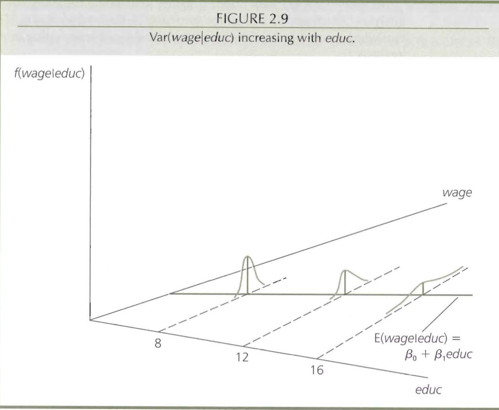

```{r, ref.label="intro setup"}

rm(list=ls())

```


Today: 
===================================================================

- Brief review of controls

- Clustering

- OLS vs GLS


---

Let's think back to our motivating problem: We want to study a relationship that is causal, interesting, and possibly ``identifiable''

>- Let's imagine a researcher wants to understand the relationship between city size and public goods provision. What might the theory be here?

>- He specifies the model: $ServiceQuality_{i} = \alpha + \beta_{1}population_{i} + \epsilon_{i}$

>- What assumptions do we need? On the coefficient $\beta$ and on the SEs of $\beta$. 

>- What might we be particularly concerned about here?


---

Let's think through strategies of fixing these problems...

>- IV?

>- Selection on observables? What might we control for?

---

- Why are post-treatment controls more of a concern than pre-treatment controls?

- (A broader question) Is it good to show that a model is robust to different specifications? 


---

Imagine a researcher wants to understand the effect of insurance coverage on support for Trump. She wants to control for whether the respondent is liberal or conservative. 

```{r}

bias_post <- NA
bias_nopost <- NA


for ( i in 1:1000){
  
  ##Independent variable
insurance <- sample(rep(c(0,1), 500), 1000, replace = FALSE)

##Outcome variable
trump <- 0.1 + rnorm(1000, 3.5, 1) * insurance + rnorm(1000, 0, 4)


##Control
liberal <- 0.2 + rnorm(1000, 3, 1) * insurance + trump*runif(1000, 0,1) + rnorm(1000, 0, 2)

##Get size of bias
bias_post[i] <- summary(lm(trump~insurance+liberal))$coef[2] - 3.5

bias_nopost[i] <- summary(lm(trump~insurance))$coef[2] - 3.5

}
```

---


```{r}
plot(density(bias_post), col = "red", xlim=c(-10,10))
lines(density(bias_nopost), xlim=c(-10,10), lty = 2, col = "slateblue")
```

---

Clustering
===================================================================

>- What are SEs? Why do we care about them?


>- Let's remember our derivation of the variance estimator in OLS. 

>- Because $\hat{\beta} = \beta + (X'X)^{-1}X'\epsilon$
\begin{align*}
V(\hat{\beta}|X) &= V(\beta|X) + V[(X'X)^{-1}X'\epsilon|X]\\
& = (X'X)^{-1}X'V[\epsilon|X]((X'X)^{-1}X')'\\
& = (X'X)^{-1}X'V[\epsilon|X](X(X'X)^{-1})\\
& = (X'X)^{-1}X'\sigma^2(X(X'X)^{-1})\\
& = \sigma^2 (X'X)^{-1}
\end{align*}


>- However, there are times when we think that our errors may not be indepedent of one another but rather, correlated.


---


For example, some municipalities are selected (not necessarily randomly) to receive a central government-administered grant to improve water quality. A researcher thinks that benefiting from this grant may lead residents of a municipality to become more supportive of the incumbent. She surveys individuals from a number of municipalities and analyzes her study. What might be a concern arising from the normal OLS assumptions? 

>- Are we concerned about errors being correlated across clusters or within clusters?  Why?


---

```{r}

##Individual potential outcomes

yi1 <- c(8, 10, 4, 6, 3, 2)

yi0 <- c(4, 6, 5, 7, 1, 0)

##Did the individual's municipality get the grant? 

treat <- c(1, 1, 0, 0, 1, 1)

muni <- c("elkin", "elkin", "jonesville", "jonesville",
          "winston salem", "winston salem")

cluster <- as.vector(sapply(1:3, function(x) rep(x, 2)))


```

---

```{r}

muni_df <- cbind.data.frame(muni, cluster, treat, yi0, yi1)

muni_df 

ACE <- muni_df$yi1-muni_df$yi0


```

Let's (for now) pretend the block grants were randomly assigned to municipalities. Why might we want to cluster our standard errors here?


---

DGP

```{r}


m <- 80 # cluster size
C <- 100 # nr of clusters
N <- m*C
cl <- rep(1:C, each=m)

y_0 <- c(rnorm(N/8, 0, 2), rnorm(N/4, 3, 2), rnorm(N/4, 5, 1), 
         rnorm(N/4, 7, 1), rnorm(N/8, 8, 2))
y_1 <- y_0 + rnorm(N, 3, 1)


```

What is the average causal effect?
```{r}

ACE <- mean(y_1) - mean(y_0)
ACE
```

---

We will assign 4000 units to treatment and 4000 to control

```{r}

simulation <- function(){
    
    simple_random <- sample(c(rep(1, N/2), rep(0, N/2)), N, replace=F)
    
    clusters_treat <- sample(1:C, C/2, replace=FALSE)
    
    
    g <- function(x) {sum(x==clusters_treat)}
    
    cluster_random <- unlist(lapply(cl, FUN=g))
    
    # ##Could also use a for loop.
    
    #cluster_random <- NA
    
    #for(i in 1:length(cl)){ 
      
      #cluster_random[i] <- sum(cl[i]==clusters_treat)
      
    #}
    
    # diff in means simple random assignment
    dm_sr <- mean(y_1[simple_random==1]) - mean(y_0[simple_random==0])
    
    # diff in means cluster assignment, individual
    dm_cl <- mean(y_1[cluster_random==1]) - mean(y_0[cluster_random==0])

    # diff in means cluster assignment, cluster means
    cl_treat <- unlist(lapply(clusters_treat, FUN=function(x) mean(y_1[cl==x])))
    
    cl_control <- unlist(lapply(as.vector(1:C)[-(clusters_treat)], 
                                 FUN=function(x) mean(y_0[cl==x])))
    
    dm_cl_cl <- mean(cl_treat) - mean(cl_control)
    
    return(c(dm_sr, dm_cl, dm_cl_cl))
    
}        
```


---

```{r}

simulation()

sims <- replicate(10000, simulation())

```

How do we expect the results to look?

---

```{r}
plot(density(sims[1, ]), col="red", lwd=3, xlim=c(min(sims),max(sims)))
abline(v=ACE, col="grey", lwd=3)
```

---

```{r}
plot(density(sims[1, ]), col="red", lwd=3, xlim=c(min(sims),max(sims)))
abline(v=ACE, col="grey", lwd=3)
lines(density(sims[2, ]), col="slateblue", lwd=3)
```

---

```{r}
plot(density(sims[1, ]), col="red", lwd=3, xlim=c(min(sims),max(sims)))
abline(v=ACE, col="grey", lwd=3)
lines(density(sims[2, ]), col="slateblue", lwd=3)
lines(density(sims[3, ]), col="deepskyblue", lwd=3, lty=3)
```

---

```{r}
apply(sims, MARGIN=1, FUN=mean)
apply(sims, MARGIN=1, FUN=sd)


```


The problem: OLS and Heteroscedasticity
===================================================================

Homoskedasticity

```{r pressure, echo=FALSE, fig.width = 7, fig.height = 3}
knitr::include_graphics("homoskedastic.png")
```


---

Heteroskedasticity

```{r echo=FALSE, fig.width = 7, fig.height = 3}

```

We'll work on this more next week!

---

Setup
```{r}

y_0 <- rnorm(100, 0, 1)
y_1 <- y_0 + rnorm(100, 2, 10)

sd(y_0)
sd(y_1)

treat <- rbinom(100, 1, .5)
Y <- ifelse(treat==1, y_1, y_0)

```

---

```{r}
link <- "https://raw.githubusercontent.com/unc421/231b/master/Functions/t_test.R"

source(link)

ttest(Y, treat)
summary(lm(Y~treat))

```

---

It will often be the case in experiments that 
$$E(\epsilon|T) \not= \sigma^2$$ 
Indeed,
$$E(\epsilon_i|T_i=1)=Var(Y_i(1))$$
$$E(\epsilon_i|T_i=0)=Var(Y_i(0))$$
which are only equal when $$Var(Y_i(1))=Var(Y_i(0))$$

---

Back to section 4. How do we calculate $SE(\hat{\beta})$ when we assume homoskedasticity?

```{r}
# The first thing we will need here is to build the matrix for X
X <- cbind(1, treat)

# getting the betas
betas <- solve(t(X)%*%X) %*% t(X)%*%Y

# and the residuals
e <- Y - X %*% betas

# and now we want the estimated sigma squared
hat_sigma2 <- sum(t(e)%*%e) / (nrow(X)-length(betas))

# and we can find estimated standard errors from $\hat{\sigma^2}(X'X)^{-1}$.
var_hat_beta <- hat_sigma2 * solve((t(X)%*%X)) # Why do we use * instead of %*% here?

# and get the SEs for our betas
se_hat_beta <- sqrt(diag(var_hat_beta))
se_hat_beta

```


